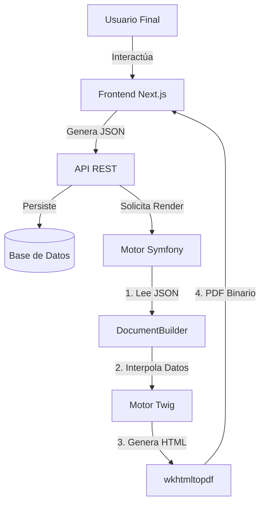

# 2. Análisis Técnico Funcional (ATF)

## 2.1 Arquitectura del Sistema

El sistema opera bajo una arquitectura desacoplada Frontend-Backend, comunicándose mediante JSON estructurado.

### 2.1.1 Diagrama de Componentes

---

## 2.2 Especificación de Componentes (Catálogo)

Los componentes son las piezas fundamentales (Legos) con las que se construyen los informes. Existen en espejo tanto en Frontend (React) como en Backend (PHP Class).

### 2.2.1 Contenedor (`Container`)
Elemento estructural base. Puede actuar como Flexbox o Grid.
*   **Atributos**:
    *   `flexDirection`: `row` | `column`.
    *   `alignItems`: `start` | `center` | `end`.
    *   `justifyContent`: Distibución del espacio.
    *   `gap`, `padding`, `margin`: Espaciados (px).
    *   `backgroundColor`, `border`: Estilos visuales.
    *   `columns`, `rows`: (Solo Grid) Definición de rejilla.
*   **Backend Mapper**: `App\Renderer\ContainerRenderer`. Traduce atributos a estilos CSS inline.

### 2.2.2 Texto (`Text`)
Bloque de contenido textual rico.
*   **Atributos**:
    *   `text`: Contenido (soporta interpolación `{{ variable }}`).
    *   `fontSize`, `fontWeight`, `color`, `textAlign`.
    *   `fontStyle` (italic), `textDecoration` (underline).
*   **Regla de Negocio**: Detecta patrones `{{ var }}` y los sustituye por datos del `DataProvider` activo.
*   **Backend Mapper**: `App\Renderer\TextRenderer`.

### 2.2.3 Tabla Dinámica (`Table`)
Elemento complejo para listar ítems (ej. líneas de factura).
*   **Atributos**:
    *   `columns`: Array de definiciones de columna (Header, Datakey, Width).
    *   `data`: (Frontend) Datos de prueba. (Backend) Inyectado por `DataProvider`.
    *   `variant`: `simple` | `striped` | `bordered`.
*   **Regla de Negocio**: Itera sobre la colección principal del informe (ej. `products`).
*   **Backend Mapper**: `App\Renderer\TableRenderer`. Genera HTML `<table>` estándar.

### 2.2.4 Etiqueta: Valor (`LabelValue`)
Componente compuesto para fichas técnicas.
*   **Atributos**:
    *   `label`: Texto estático (negrita).
    *   `value`: Texto dinámico o componente.
    *   `labelWidth`: Ancho fijo opcional para alineación vertical.
*   **Backend Mapper**: Renderizado como un `Container` con 2 hijos internos.

### 2.2.5 Imagen, Separador, Header/Footer
*   **Imagen**: Soporta URL remota o Base64.
*   **Separador**: Línea `
` con estilo.
*   **Header/Footer**: Áreas reservadas que se repiten en cada página del PDF (gestión por `@page` CSS).

---

## 2.3 Servicios de Backend (Simulación)

La lógica de negocio reside en `symfony_export/src`.

### 2.3.1 `DocumentGenerator` (Service)
Orquestador principal.
1.  Recibe el JSON Template.
2.  Invoca a `ContentBuilder` para recorrer el árbol de nodos recursivamente.
3.  Para cada nodo, busca su `Renderer` compatible (vía interfaz `ComponentRendererInterface`).
4.  Concatena el HTML resultante.
5.  Envuelve el HTML en un layout base (con estilos globales y fuentes).

### 2.3.2 `PdfChannel`
Encargado de la conversión final.
*   Usa librería `KnpSnappyBundle` (wrapper de `wkhtmltopdf`).
*   **Configuración Crítica**:
    *   `--page-size`: A4.
    *   `--print-media-type`: Para asegurar que CSS de impresión se aplique.
    *   `--enable-local-file-access`: Permiso para leer imágenes del disco.

---

## 2.4 Modelo de Datos

### Entidad `Template`
*   `id`: UUID.
*   `name`: String (Nombre comercial).
*   `content`: JSONB (La estructura completa del informe).
*   `reportType`: Enum (ej. `invoice`, `clinical`, `budget`).
*   `active`: Boolean.
*   `version`: Integer.

### Entidad `ReportType` (Maestro)
Definición de qué datos están disponibles para cada tipo.
*   `code`: `invoice`.
*   `variables`: Lista de variables disponibles (`client.name`, `total`, `date`, etc.) para el autocompletado del editor.

---

## 2.5 Reglas de Negocio/Validaciones
1.  **Integridad JSON**: El editor no permitirá guardar si el JSON está corrupto.
2.  **Validación de Variables**: Si una variable `{{ var }}` no existe en el contexto, se renderiza vacía (no explota), pero se puede configurar para mostrar alerta en modo Debug.
3.  **Fuentes**: Solo se permiten fuentes web-safe o incrustadas en base64 en el CSS global para garantizar que el PDF se vea igual que la Web.
