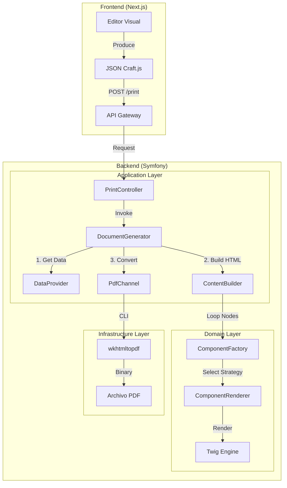
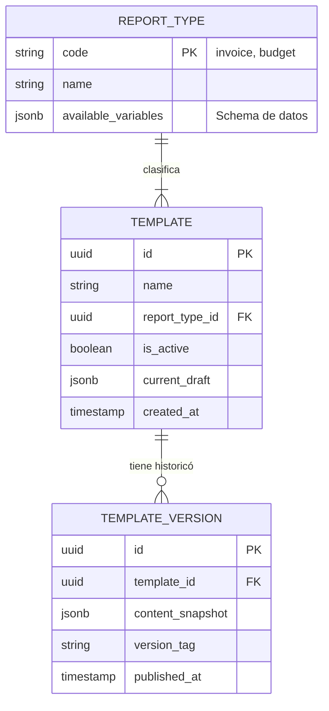

# Análisis Técnico Funcional (ATF) - Detallado

**Proyecto**: Report Builder Platform
**Versión del Documento**: 2.0 (Para Confluence)
**Fecha**: 02/01/2026

---

## 1. Arquitectura y Patrones de Diseño

El sistema implementa una **Arquitectura Hexagonal (Ports & Adapters)** simplificada para garantizar el desacoplamiento entre la generación del documento y la infraestructura de salida (PDF, HTML, Email).

### 1.1 Diagrama de Arquitectura Global


*Diagrama de alto nivel que muestra el flujo de datos desde el Frontend hacia el motor de impresión.*



### 1.2 Patrones de Diseño Implementados

| Patrón | Implementación | Justificación |
| :--- | :--- | :--- |
| **Factory Method** | `ComponentFactory::getRenderer($type)` | Permite instanciar el renderizador correcto (Texto, Tabla, Imagen) dinámicamente según el nodo del JSON sin acoplar el `ContentBuilder`. |
| **Strategy** | `ComponentRendererInterface` | Cada componente (Text, Container) encapsula su propia lógica de renderizado. El sistema puede extenderse añadiendo nuevos renderers sin modificar el núcleo. |
| **Composite** | `ContentBuilder::renderNode` (Recursivo) | Trata a componentes individuales y contenedores de manera uniforme, permitiendo anidamiento infinito (Cajas dentro de Cajas). |
| **Adapter** | `SnappyPdfAdapter` | Envuelve la librería externa `wkhtmltopdf`, permitiendo cambiar el motor de generación de PDF en el futuro si fuera necesario (ej. a Puppeteer). |

---

## 2. Modelo de Datos (Esquema de Base de Datos)

Aunque el motor de renderizado es *stateless*, se requiere persistencia para guardar las plantillas y configuraciones.

### 2.1 Diagrama Entidad-Relación (Propuesto)



### 2.2 Diccionario de Tablas

#### Tabla `template`
Almacena la definición viva de los informes.

| Columna | Tipo | Descripción |
| :--- | :--- | :--- |
| `id` | UUID | Identificador único. |
| `name` | VARCHAR(255) | Nombre legible (e.g., "Factura Clientes VIP"). |
| `content` | JSONB | El árbol de nodos generado por React Craft.js. |
| `config` | JSONB | Configuración física (Márgenes, Tamaño Papel, Orientación). |
| `report_type_code` | VARCHAR(50) | FK a `report_type` (e.g., 'invoice'). |

---

## 3. Servicios del Backend y Casos de Uso

### 3.1 Catálogo de Servicios (Service Container)

| Servicio | Clase PHP | Responsabilidad |
| :--- | :--- | :--- |
| **Generador** | `App\Service\DocumentGenerator` | **Fachada principal**. Coordina la obtención de datos, el renderizado HTML y la conversión a PDF. Es el único punto de entrada para los controladores. |
| **Constructor** | `App\Service\ContentBuilder` | **Parser**. Recorre el array JSON recursivamente. Si encuentra un nodo con hijos (`children`), se llama a sí mismo antes de cerrar el tag HTML del padre. |
| **Fábrica** | `App\Service\ComponentFactory` | **Resolver**. Usa `TaggedIterator` de Symfony para coleccionar todos los servicios etiquetados como `app.component_renderer`. |
| **Proveedor** | `App\Provider\InvoiceDataProvider` | **Data Fetcher**. Se conecta al ERP/Base de Datos real para obtener los datos de la factura (Lineas, Totales, Cliente) dado un ID. |

### 3.2 Flujo de Caso de Uso: "Imprimir Informes Contextuales"

El controlador ha sido diseñado para ser agnóstico al tipo de informe, recibiendo un "Context Bag" (Bolsa de parámetros) que depende del negocio.

1.  **Request Universal**:
    ```json
    POST /print/{templateId}
    {
      "context": {
        "store_id": 105,
        "sale_id": "TICKET-2024-99",
        "graduation_id": 450 // Opcional, solo para óptica
      },
      "transport": "download" // download | email | cloud_print
    }
    ```

2.  **Estrategia de Transporte**:
    *   `download`: Retorna un stream binario con `Content-Disposition: attachment`.
    *   `email`: Encola un Job asíncrono (`RabbitMQ`) para enviar el PDF adjunto. Retorna `200 OK { job_id: "..." }`.
    *   `preview`: Retorna el binario inline para previsualización en navegador.

3.  **Data Provider Dinámico**:
    *   El `DataProvider` recibe el array `context` completo.
    *   *Ejemplo Optometría*: Usa `graduation_id` para buscar esferas/cilindros y `store_id` para la cabecera.
    *   *Ejemplo Ticket*: Usa solo `sale_id`.

---

## 4. Especificaciones de Calidad de Impresión (DPI y Color)

La conversión HTML -> PDF es crítica para la fidelidad física.

### 4.1 Resolución (DPI)
*   **Implementación**: Se fuerza el flag `--dpi 300` al motor `wkhtmltopdf`.
*   **Assets**: Las imágenes subidas por el usuario deben tener una resolución efectiva de 300 PP.
*   **Escalado**: El CSS utiliza unidades absolutas (`mm`, `cm`) en lugar de píxeles para garantizar que 210mm sean exactamente el ancho de un A4 físico.

### 4.2 Gestión de Color (RGB vs CMYK)
*   **Modelo de Color**: El motor PDF genera salida en **sRGB**.
*   **Limitación**: Los navegadores y motores web no renderizan CMYK nativo.
*   **Impresión Profesional**: Para imprentas offset que exijan CMYK puro, se requiere un post-procesamiento con **Ghostscript** sobre el PDF final.
    *   *Comando Post-Proceso (Opcional)*: `gs -dProcessColorModel=/DeviceCMYK ... input.pdf`.
*   **Modo B/N**: Para impresoras térmicas de tickets, se puede activar el flag `--grayscale` en el `PdfChannel` si el `report_type` es `receipt`.

---

## 5. Estructura del JSON (Contrato Frontend-Backend)

El backend espera un JSON con esta estructura específica (simplificada):

```json
{
  "ROOT": {
    "type": { "resolvedName": "Container" },
    "props": { "flexDirection": "column" },
    "nodes": ["node-1", "node-2"]
  },
  "node-1": {
    "type": { "resolvedName": "Text" },
    "props": { "text": "Factura {{ number }}" }
  },
  "node-2": {
    "type": { "resolvedName": "Table" },
    "props": { 
      "columns": [{ "header": "Precio", "dataKey": "price" }] 
    }
  }
}
```

### Reglas de Mapeo
*   **`resolvedName`** debe coincidir exactamente con el nombre soportado por un `Renderer` en Symfony.
*   **`props`** se pasan directamente al método `render($props)` de la clase PHP.
